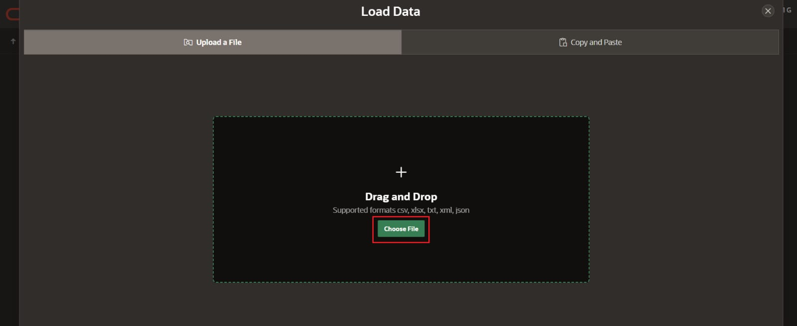
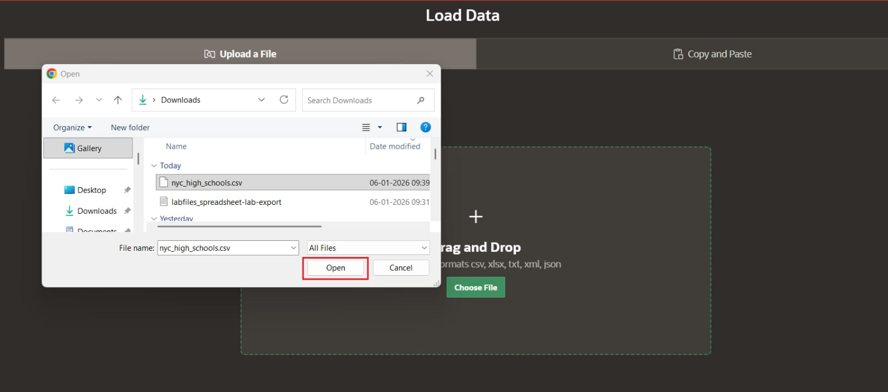
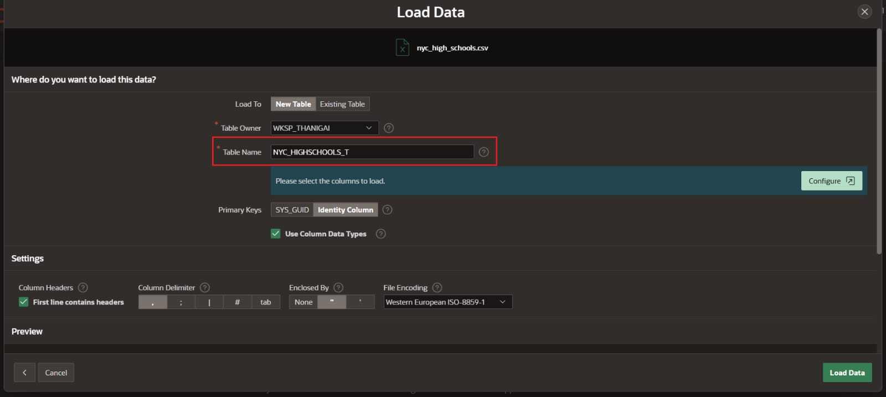
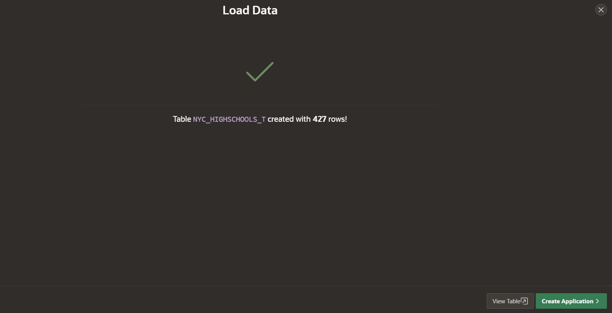
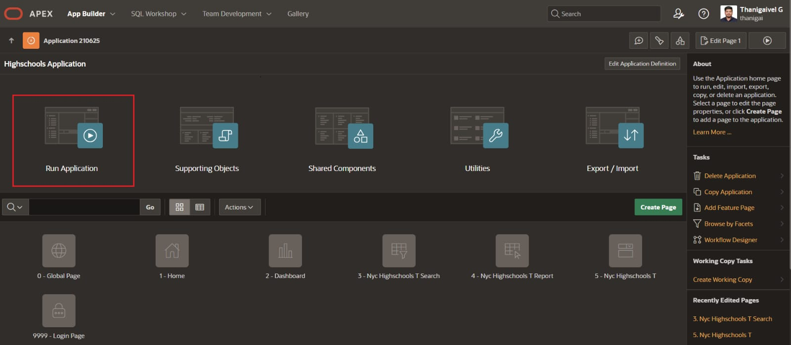
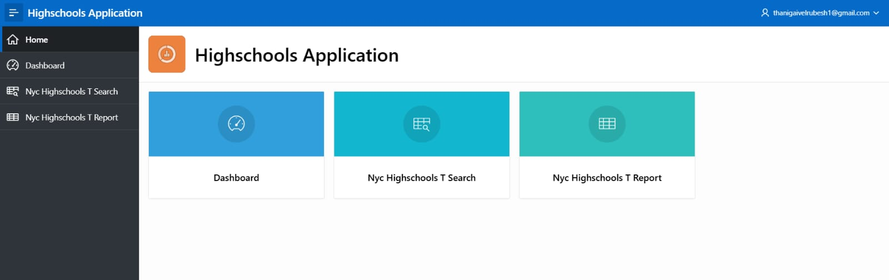
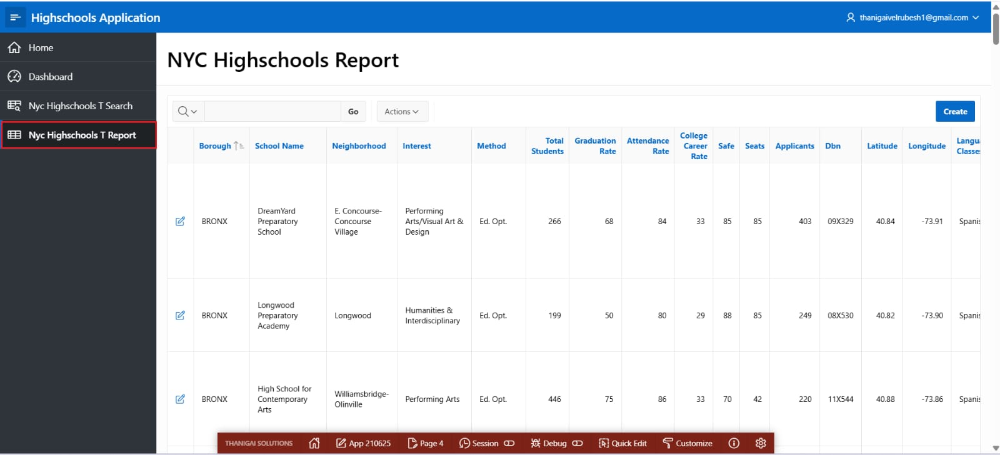
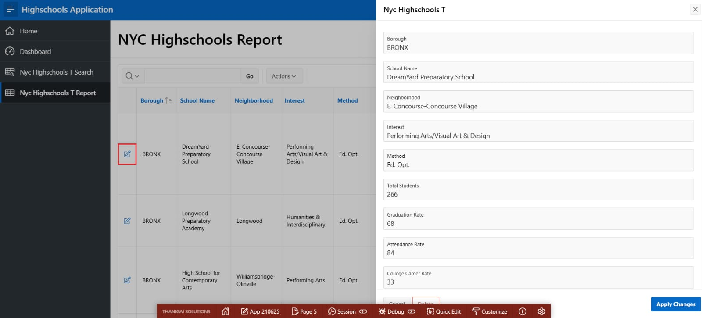

# Oracle APEX Live Labs – Spreadsheet to Application 🚀

This repository documents my **hands-on completion of Oracle APEX Live Labs**, where a spreadsheet is converted into a fully functional **Oracle APEX application**.

The README includes **step-by-step screenshots** captured during the lab for learning and reference purposes.

---

## 📘 Lab Overview

**Lab Title:** Converting Spreadsheets into an Oracle APEX Application  
**Platform:** Oracle Live Labs  
**Technology:** Oracle APEX  

In this lab, I learned how to:
- Upload a spreadsheet into Oracle APEX
- Automatically generate tables
- Create an application using the APEX wizard
- Run and validate the generated application

---

## 🧪 Hands-on Steps with Screenshots

### Step 1: Starting the Oracle Live Lab

  

---

### Step 2: Uploading the Spreadsheet

   

 

   

 
 

   

 
 

   

---

### Step 3: Creating the APEX Application

   

 

   

---

### Step 4: Previewing the Generated Application

   

 

   

 

   

---

## ✅ Outcome

- Spreadsheet data successfully converted into an Oracle APEX application
- Tables and pages auto-generated
- Application ready for enhancements and deployment

---

## 🔗 References

- Oracle APEX Live Labs: [https://apex.oracle.com/livelabs](https://livelabs.oracle.com/ords/r/dbpm/livelabs/view-workshop?wid=631&clear=RR,180&session=6192321544588)
- Oracle APEX Documentation: https://docs.oracle.com/en/database/oracle/apex/

---

## 👨‍💻 Author

**Thanigai Solutions**  
📺 YouTube Channel: https://www.youtube.com/@ThanigaiSolutions  

If you find this useful:
- ⭐ Star this repository  
- 👍 Like and subscribe to the YouTube channel  

Happy APEX Learning! 🚀
